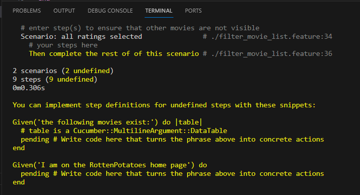

# Práctica Calificada 5

***

## Pregunta 1

Si el usuario introduce de manera manual un URI para ver (Show) una película que no existe (por ejemplo /movies/99999), verás un mensaje de excepción horrible. Modifica el método show del controlador para que, si se pide una película que no existe, el usuario sea redirigido a la vista Index con un mensaje más amigable explicando que no existe ninguna película con ese.

1. Se observan dos excepciones, una en el terminal y otra en el browser

- Browser


- Terminal


2. Para resolver esto modificamos el método show del controlador 

- Añadimos la condicional if @movie.nil? para verificar si la pelicula existe o no, en caso no exista redireccionamos a la página index y mostramos el mensaje "Movie wasn't found"


- Así se vería en el browser


***

## Pregunta 2

El método auth_hash  tiene la sencilla tarea de devolver lo que devuelva OmniAuth como resultado de intentar autenticar a un usuario. ¿Por qué piensa que se colocó esta funcionalidad en su propio método en vez de simplemente referenciar request.env[’omniauthauth’] directamente? Muestra el uso del script.

```Ruby
class SessionsController < ApplicationController
 	def create
    @user = User.find_or_create_from_auth_hash(auth_hash)
    self.current_user = @user
    redirect_to '/'
  end
  protected
  def auth_hash
    request.env['omniauth.auth']
  end
end

```
***

## Pregunta 3

En las actividades relacionados a JavaScript, Siguiendo la estrategia del ejemplo de jQuery utiliza JavaScript para implementar un conjunto de casillas de verificación (checkboxes) para la página que muestra la lista de películas, una por cada calificación (G, PG, etcétera), que permitan que las películas correspondientes permanezcan en la lista cuando están marcadas. Cuando se carga la página por primera vez, deben estar marcadas todas; desmarcar alguna de ellas debe esconder las películas con la clasificación a la que haga referencia la casilla desactivada.

1. Primero creamos una película para cada rating de tal manera que se pueda visualizar el ejemplo


2. Añadimos los checkboxes dentro de la vista index.html.erb utilizando las clases de bootstrap, también añadimos las funcionalidades de tal manera que cuando se actualice la vista dependiendo de los "selected ratings" y por último inicializamos los checkboxes como marcados


3. El resultado es el Siguiente

- Checkboxes al inicio (todos seleccionados)


- Checkbox G seleccionado


- Checkbox PG seleccionado


- Checkbox PG-13 seleccionado


- Checkbox R seleccionado


***

## Pregunta 4

De la actividad relacionada a BDD e historias de usuario crea definiciones de pasos que te permitan escribir los siguientes pasos en un escenario de RottenPotatoes:

Given the movie "Inception" exists
	And it has 5 reviews
	And its average review score is 3.5

***
## Pregunta 5

De la actividad relacionadas a BDD e historias de usuario, supongamos que en RottenPotatoes, en lugar de utilizar seleccionar la calificación y la fecha de estreno, se opta por rellenar el formulario en blanco. Primero, realiza los cambios apropiados al escenario. Enumera las definiciones de pasos a partir que Cucumber invocaría al pasar las pruebas de estos nuevos pasos. (Recuerda: rails generate cucumber:install)


***
## Pregunta 6

De la actividad relacionadas a BDD e historias de usuario indica una lista de pasos para implementar el siguiente paso:

When / I delete the movie: "(.*)"/ do |title|

***
## Pregunta 7

Basándose en el siguiente fichero de especificaciones (specfile), ¿a qué métodos deberían responder las instancias de F1 para pasar las pruebas?

```ruby
require 'f1'
	describe F1 do
    describe "a new f1" do
      before :each do ; @f1 = F1.new ; end

      it "should be a pain in the butt" do
        @f1.should be_a_pain_in_the_butt
      end

      it "should be awesome" do
        @f1.should be_awesome
      end

      it "should not be nil" do
        @f1.should_not  be_nil
      end
      
      it "should not be the empty string" do
        @f1.should_not == ""
    end
  end
end
```

1. El código dado está hecho en RSpec utilizando TDD, para estas metodologías primero se requiere de rails_helper es decir

```Ruby
require 'rails_helper'
```

2. Luego describimos la clase con la que vamos a trabajar

```Ruby
describe Pc5Class do
```

3. Dentro de esta definición escribimos el escenario en el que vamos a realizar las pruebas con su respectiva funcion

```Ruby
describe "a new PC5" do
```

4. Inicializamos los datos a utilizar (Arrange)

```Ruby
before :each do ; @softwarePC5 = Pc5Class.new ; end
```

5. Por último definimos los métodos a verificar

```Ruby
it "should be a pin in the butt" do
  @softwarePC5.should be_a_pain_in_the_butt
end
```

```Ruby
it "should be awesome" do
  @softwarePC5.should be_awesome
end
```

```Ruby
it "should not be nil" do
  @softwarePC5.should_not be_nil
end
```

```Ruby
it "should be the empty string" do
  @softwarePC5.should_not == ""
end
```

6. Ejemplo extra:

```Ruby
it "should improve my grades" do
  expect(@softwarePC5.grade).to equal(20)
end
```

Todo en conjunto se vería así

```Ruby
require 'rails_helper'
describe Pc5Class do
  describe "a new PC5" do
    before :each do ; @softwarePC5 = Pc5Class.new ; end

    it "should be a pain in the butt" do
      @softwarePC5.should be_a_pain_in_the_butt
    end

    it "should be awesome" do
      @softwarePC5.should be_awesome
    end

    it "should not be nil" do
      @softwarePC5.should_not  be_nil
    end
      
    it "should not be the empty string" do
      @softwarePC5.should_not == ""
    end

    it "should improve my grades" do
      expect(@softwarePC5.grade).to equal(20)
    end
  end
end
```

-
***
## Pregunta 8
Escribirás escenarios de Cucumber que prueben los happy paths de las partes 1 a 3 de la tarea de introducción a Rails, en la que agregaste filtrado y clasificación a la vista de índice de películas de RottenPotatoes.

El código de la aplicación en rottenpotatoes contiene una solución "canónica" para la tarea de introducción de Rails sobre la cual escribir sus escenarios y el andamiaje necesario para los primeros escenarios. Utiliza la carpeta comprimida dada en la actividad.

1. Primero vamos a la carpeta dada en la actividad y hacemos un bundle install


2. Ejecutamos bundle exec cucumber para ver si la aplicación está condigurada correctamente



Nos da un error que es lógico por que aún no implementamos las pruebas

3. Para implementarlo primero eliminamos todos los pending y también implementamo la definición de cada paso


4. Completamos el escenario restrict to movies with PG or R ratings in filter_movie_list.feature.


Así como también el código para ver las las tablas creadas


***
## Pregunta 9

***
## Pregunta 10

Para el siguiente ejercicio utiliza la lista de proyectos Rails de código abierto en Open Source Rails: https://github.com/gramantin/awesome-rails#open-source-rails-apps

1. Describa 1 o más patrones de diseño que podrían ser aplicados al diseño del sistema.
 
El patrón más comun usado en los proyectos es Active Record el cual define una forma de acceder a los datos de una base de datos. Se envolverá la tabla en una clase desde la que se podrá realizar inserciones.


2. Dado un sistema simple que responde a una historia de usuario concreta, analice y elija un paradigma de diseño adecuado

Un paradigma de diseño adecuado para las historias de usuario puede ser la programación orientada a objetos dado que este mismo nos permite ordenarlo de una manera más adecuada y no se va a extender demasiado

3. Analice y elija una arquitectura software apropiada que se ajuste a una historia de usuario concreta de este sistema. ¿La implementación en el sistema de esa historia de usuario refleja su idea de arquitectura?

La arquitectura MVC (Model View Controller)..

***


